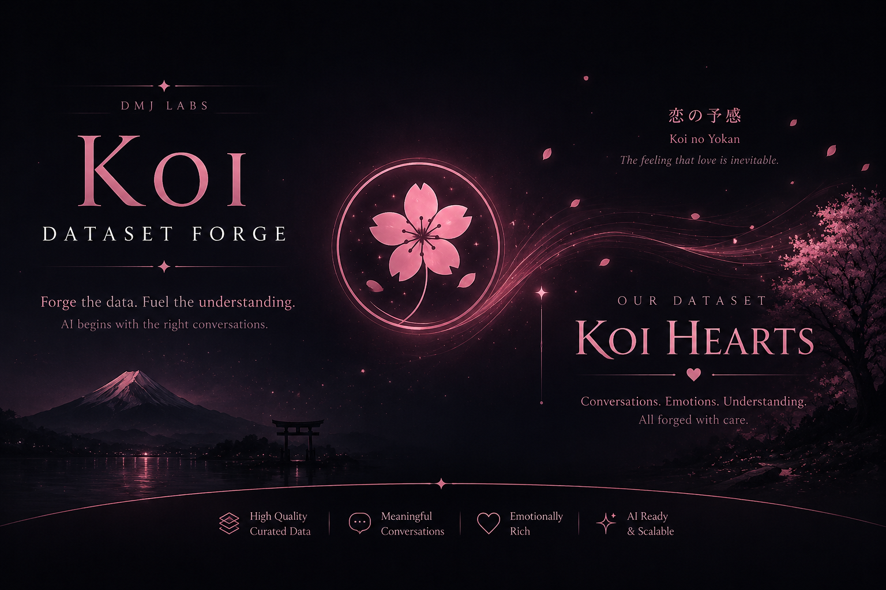

<p align="center">
  
</p>

<h1 align="center">🌸 KOI Dataset Forge</h1>

<p align="center">
<b>Every heart has a story worth understanding.</b>
</p>

<p align="center">
Human-Centered Dataset Generation Framework for Emotional Intelligence AI
</p>

---

# ❤️ Overview

**KOI Dataset Forge** is an open-source framework for generating emotionally coherent AI training datasets.

Rather than creating isolated prompts and responses, KOI Dataset Forge simulates people, their lives, emotions, and experiences before generating conversations.

The framework powers **KOI Hearts**, the official emotional conversation dataset for the **KOI Emotional Intelligence Language Model**, developed by **DMJ Labs**.

---

# 🌸 Vision

Most datasets ask:

> **"What should the AI say?"**

KOI asks:

> **"Who is the person behind these words?"**

Every conversation begins with a believable person.

Every person has a life.

Every life creates experiences.

Every experience shapes emotions.

Every emotion reveals a need.

Only then should an AI respond.

---

# 🧠 Scientific Inspiration

KOI Dataset Forge is inspired by established research in psychology and artificial intelligence.

| Foundation | Purpose |
|------------|---------|
| 🧠 Big Five Personality Model | Personality generation |
| 🌸 Plutchik's Wheel of Emotions | Emotion modeling |
| ❤️ Maslow's Hierarchy of Needs | Human needs reasoning |
| 👤 Persona-Based Dialogue | Character generation |
| 🔗 Knowledge Graph Principles | Context modeling |
| 📚 Rule-Based AI | Consistent life simulation |

KOI builds upon these ideas with its own **Emotion Blueprint** architecture for creating emotionally coherent datasets.

---

# ❤️ What is KOI Hearts?

**KOI Hearts** is the official emotional conversation dataset generated by KOI Dataset Forge.

Each sample represents a realistic human experience rather than a random prompt.

Example:

```json
{
  "id": "KH-V1-000001",

  "person": {
    "age": 18,
    "education": "Diploma Student",
    "occupation": "Student",
    "personality": "Empathetic"
  },

  "life_event": "Preparing for final exams",

  "emotion": "Anxiety",

  "need": "Reassurance",

  "intent": "Seeking Support",

  "input": "I don't think I'm ready for tomorrow's exam.",

  "response": "It's understandable to feel anxious before something important. Try focusing on one step at a time—you've already made progress by preparing."
}
```

---

# 🌸 Generation Pipeline

Every conversation follows the same reasoning pipeline.

```text
Human
    │
    ▼
Life Profile
    │
    ▼
Personality
    │
    ▼
Life Event
    │
    ▼
Emotion
    │
    ▼
Need
    │
    ▼
Intent
    │
    ▼
Conversation
    │
    ▼
Compassionate Response
```

This makes every generated conversation internally consistent.

---

# ✨ Features

- ❤️ Human-centered dataset generation
- 🧠 Psychology-inspired emotional modeling
- 👤 Life profile simulation
- 🎭 Personality generation
- 💬 Emotion-aware conversation generation
- 📊 Dataset validation
- 📦 Dataset versioning
- 📈 Dataset statistics
- 🔄 Extensible modular architecture

---

# 🏗️ Project Architecture

```text
koi-dataset-forge/
│
├── knowledge/
│   ├── psychology/
│   │   ├── big_five.json
│   │   ├── maslow.json
│   │   └── plutchik.json
│   │
│   ├── world/
│   │   ├── education.json
│   │   ├── occupations.json
│   │   └── life_events.json
│   │
│   └── koi/
│       └── emotion_blueprint.json
│
├── generator/
│   ├── pipeline/
│   ├── engines/
│   ├── builders/
│   ├── managers/
│   ├── core/
│   └── utils/
│
├── datasets/
├── docs/
└── prompts/
```

---

# 📚 Documentation

| Document | Description |
|----------|-------------|
| `README.md` | Project overview |
| `docs/architecture/ARCHITECTURE.md` | Internal architecture |
| `docs/dataset/KOI_HEARTS_SPEC.md` | Dataset specification |
| `docs/roadmap/ROADMAP.md` | Development roadmap |

---

# 🚀 Current Development

- ✅ Framework architecture
- ✅ Dataset generator
- ✅ Life Engine
- 🚧 Knowledge Layer
- 🚧 Emotion Blueprint
- 🚧 Conversation Engine
- 🚧 KOI Hearts v1

---

# 🌸 Philosophy

> **Every heart has a story worth understanding.**

KOI does not generate conversations from prompts.

KOI generates conversations from people.

---

# 🤝 Contributing

Contributions are welcome.

Whether you're improving the Life Engine, expanding psychological knowledge, refining conversations, or improving documentation, every contribution helps KOI better understand people.

---

# 📄 License

This project is licensed under the **DMJ Community License (DCL)**.

See the LICENSE file for details.

---

# 🌌 DMJ Labs Ecosystem

| Project | Purpose |
|----------|---------|
| 🌙 Saudade | Memory & Knowledge Language Model |
| 🏔️ Hiraeth | Technical Reasoning Language Model |
| 🌸 KOI | Emotional Intelligence Language Model |
| ❤️ KOI Hearts | Emotional Conversation Dataset |
| 🔨 KOI Dataset Forge | Dataset Generation Framework |

---

<p align="center">

**Every heart has a story worth understanding.**

</p>